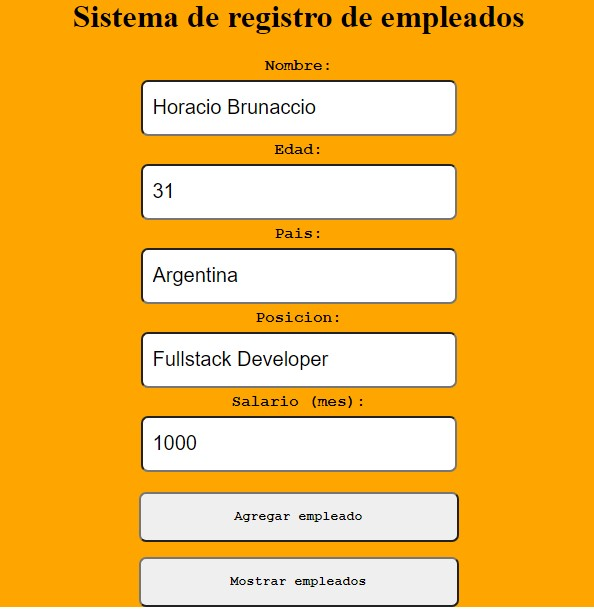

# CRUD-Fullstack

<h4>CRUD con React Js,Node,Express y Mysql</h4>

Primera app completa y primer base de datos.:muscle:

Sistema de registro de empleados que guarda informacion en base de datos.Crea nuevos empleados,los actualiza y los elimina.Tambien actualiza el salario pretendido.

Api construida con Node y Express

Hay un estado por cada variable que envia información a la base de datos.Usé el metodo <strong>onChange</strong> para que ejecute una 
funcion cada vez que
cambie algo(el valor)en el formulario y tambien el estado.

La base de datos está incluida en la carpeta del servidor:file_folder: y consta de una tabla:
|id|nombre|edad|pais|posicion|salario
|--|------|----|----|--------|--------------

Usé la libreria <strong>Axios</strong> para las solicitudes a la api y el metodo map para mostrar los empleados registrados en el cuadro inferior.

Comentarios adicionales  en el código.:memo:

Para ejecutar, desde el directorio client ,npm start y desde el server ,start node index.js,cambiar el password de la conexion a la base de datos y si es necesario el puerto. En la carpeta db esta en archivo sql.

